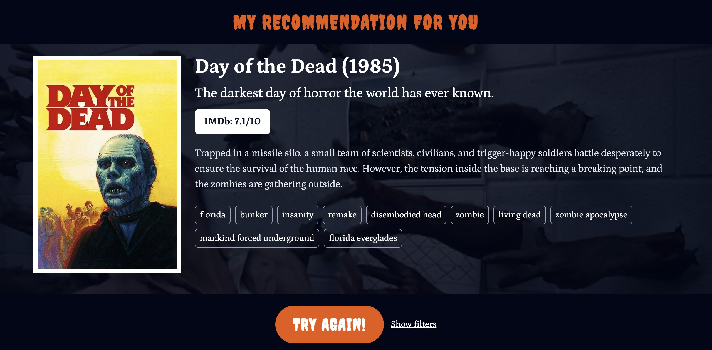

<h1 align="center">Monster Movie Mate</h1>
  

    Horror movie advisor. A project using TMDB, OMDb, and fabulous animations from LottieFiles. Also, special thanks to ChatGPT for the name.
  

  

    
  

  

    <a href="https://monster-movie-mate.vercel.app/">View Demo</a>
  

<!-- ABOUT THE PROJECT -->

## About The Project

Get ready for a spooktacular Halloween movie night with our horror movie advisor! 🧟‍♂️

Just open the app, and it will suggest a scary movie for you. If you're not thrilled with the first choice, click "Try again" for a new recommendation.

You can also explore more details about the suggested movie by clicking on an IMDb rating button to access the IMDb page.

The app defaults to all-time high-rated movies. If you're feeling adventurous, click "Show filters" to access a variety of options for specifying the era and rating of the movie. But beware, the filters are quite opinionated 😜

### APIs used

-   [The Movie DB](https://www.themoviedb.org/)
-   [OMDb API](https://www.omdbapi.com/)

### Built With

-   [Next.js](https://nextjs.org/)
-   [React](https://react.dev/)
-   [Typescript](https://www.typescriptlang.org/)
-   [Tailwind CSS](https://tailwindcss.com/)
-   [TanStack](https://tanstack.com/)
-   [LottieFiles](https://lottiefiles.com/)

<!-- LICENSE -->

## License

Designed and developed by Vitalii Sazanov, 2023.

Distributed under the MIT License. See `LICENSE.txt` for more information.
